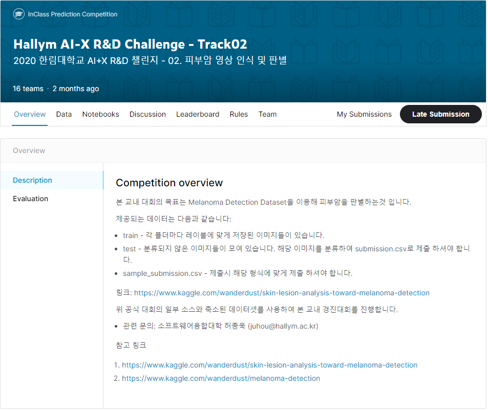
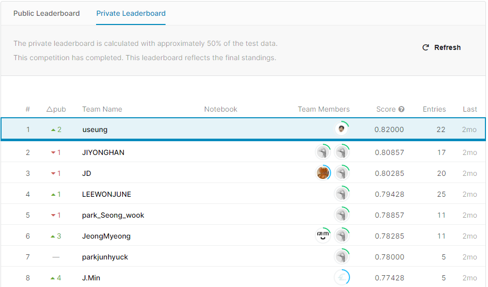
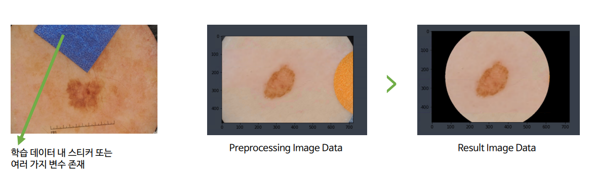
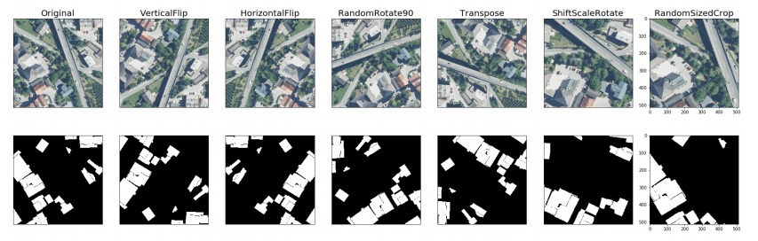

# Hallym_AI-X_RnD_Challenge
## Track02. 피부암 영상 인식 및 판별 (2020 한림대학교 AI+X R&amp;D 챌린지)

[\[Competition Page\]](https://www.kaggle.com/c/hallym-2020-2-aicomp02) 

 
Private Leaderboard : 1st (NAME : useung)

[\[Solution 참고\]](./solution_track02_report.pdf) 

### sub_log
83.667 - efficientNet b3  lr - 0.0001 ep 10

*************************************************************************************************************************
84.527 - efficientNet b3 / lr - 0.0001 / ep 10 / 
transforms(resize(320,320), CenterCrop(280,280), RandomHorizontalFlip, RandomVerticalFlip, RandomRotation(10) /
param.require_grad = True(이전 레이어 전체 학습)
data loader : train - batchsize 32 , val - batchsize 8

Dataset - image preprocessing(이미지 라운드를 통해 특징점에 더 집중할 수 있도록 데이터 증강)
Data Augmentation - OpenCV 활용
 

Albumentation
 

Best acc : 0.8574
Evaluation
Avg loss(test) : 0.0479
Avg acc(test) : 0.8702

*************************************************************************************************************************
 

Public Leaderboard Score : 0.84527
Private Leaderboard Score : 0.82000